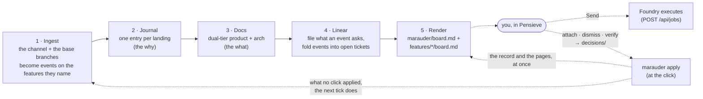
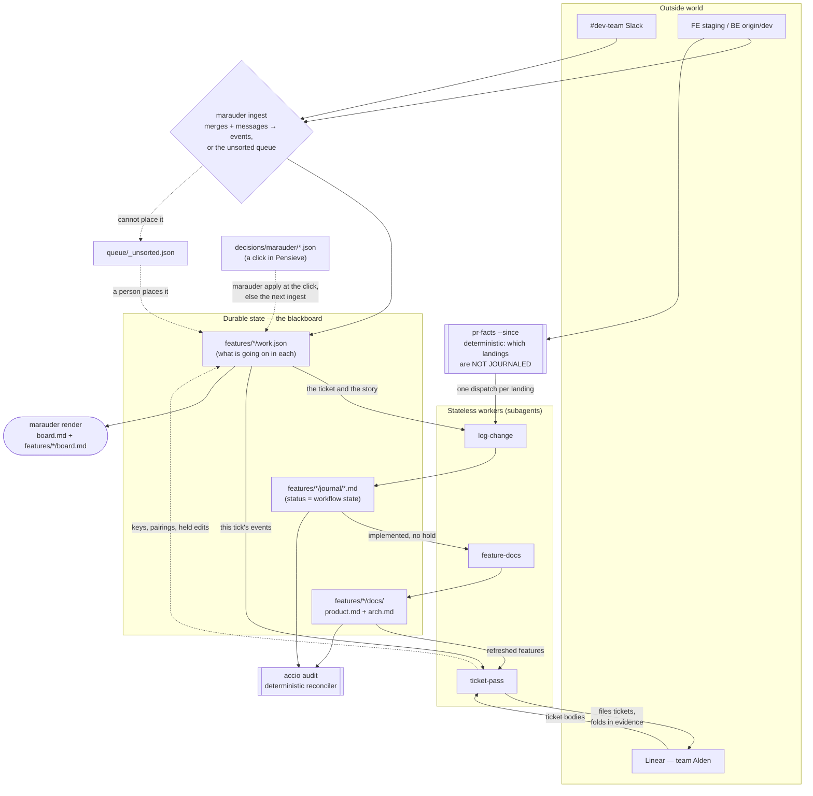
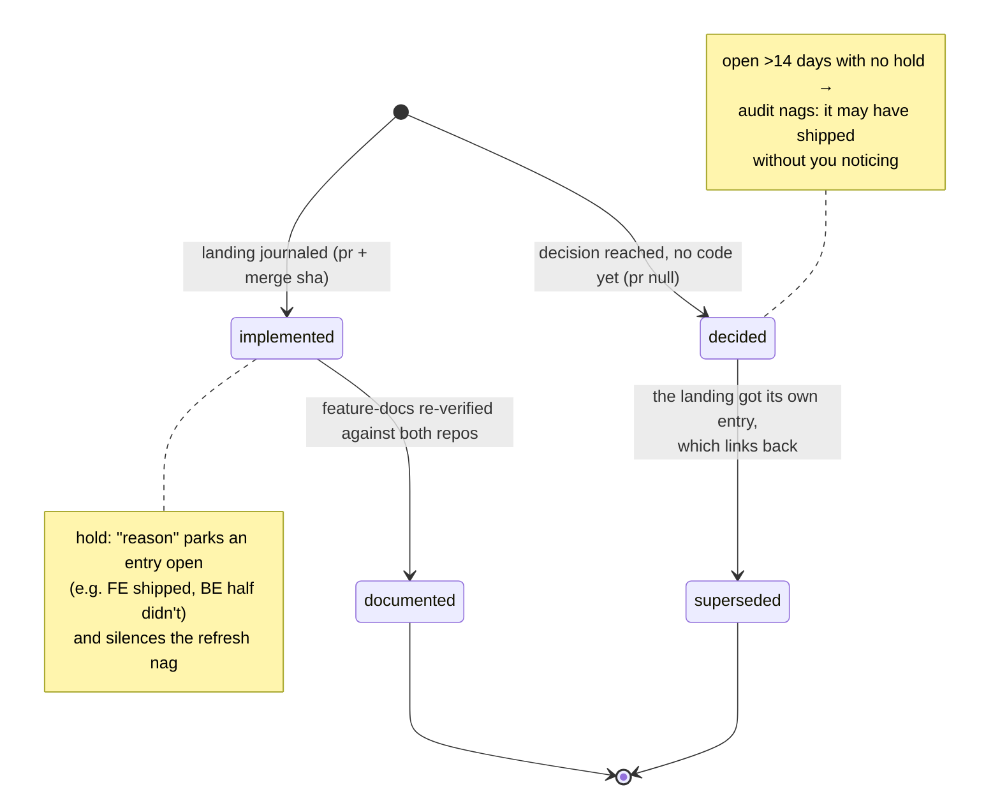
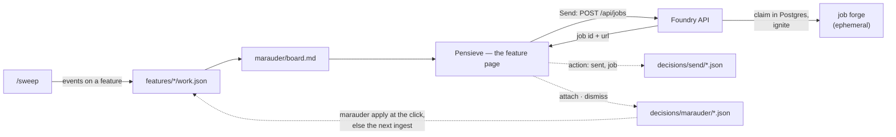

# argus

A one-person orchestration workspace for **alden-portal**: it watches the places where
change happens — #dev-team Slack, Linear (team `Alden`), and the FE/BE repos — and keeps
three records honest, all of them per feature: dual-tier docs (what is true, verified
against both repos), a change journal (why it changed), and `work.json` (what is going
on, if anything). Built for a part-time schedule: everything is
incremental, idempotent, and catch-up-safe, so the first run after days away simply
backfills.

## The three systems, as of 2026-09-10

Three repos share this work. Each has one job, and the seams between them are files and
one HTTP API — nothing else.

| | job | today | never |
|---|---|---|---|
| **argus** (this repo) | Knows. The blackboard is the single source of truth for everything not in Linear or a repo; the sweep keeps it current, reconciles landings against tickets, and surfaces what needs a decision. | Files (`features/*/docs`, `features/*/journal`, `features/*/work.json`, `queue/`, `marauder/`) plus skills run by `/loop` sessions. Renders a board; holds no queue. | Dispatch work. Close tickets. Run as a daemon. |
| **Pensieve** (`~/git/pensieve`) | The decision surface. Where you read where the work stands and decide what to act on. | Renders the board, each feature's page, the journal and the docs for every app under the blackboard; the Unsorted list places what attached to nothing on a feature; Send and Verify sit on the feature page; Ask answers over the checkout and proposes a correction, a send or a ticket that a click confirms. Writes `decisions/` and nothing else, then runs `marauder apply` so the click reaches the record at once. | Hold workflow state of its own. Write any blackboard file other than `decisions/` with its own code — the record changes only through `marauder`. |
| **Foundry** (`~/git/foundry`) | Executes. Takes a job over HTTP, runs it in an ephemeral forge, pushes a PR, reports back. | Jobs, blueprints, repos, forges, the trigger API. The `agent-ready` ticket scanner that made it a decider too is gone (ARG-93). | Read the blackboard. Judge readiness. Choose what runs. |

One line: **argus knows, you decide in Pensieve, Foundry does.**

The decision happens on the screen where the work is read: the sweep keeps one record per
feature that has something going on and renders the board from those, and Pensieve is where a queue entry is placed, a
ticket is sent to Foundry, or a held edit is confirmed. The `agent-ready` label that used
to be the handoff is retired — inert on the tickets that carry it, applied by nothing, read
by nothing — and Foundry's scanner is gone. From Ask, the model can propose a correction
that a click confirms; the tool it calls never writes. That work landed as waves 1 to 10 of
`improvements/` (one file per wave; its README is the index and `open-items.md` what is
still open), and the verdict that takes effect at the click: Pensieve writes the decision
file, then runs `marauder apply` under the lock every writing verb of the sweep holds, and
the next tick finds nothing left to apply and commits what changed (ARG-168, ARG-169). The target diagram is
`canvas/setup.json` and one tick is `canvas/graph.json` (`bun run canvas`, then
`?g=setup` for the first). "Downstream" at the bottom is the current contract.

## The loop at a glance

Each sweep tick walks five stages, each feeding the next; the board it renders is dashed
into Pensieve, because what happens after it is your call. A verdict given there comes
back as a decision file, and the click runs `marauder apply` on it, so the record and the
pages change at once; a tick's ingest applies only what a click could not:



## Architecture

The design is a blackboard, not a pipeline of agents:

- **Durable state lives in files, and the feature is the unit.** Each feature directory
  holds `docs/` (what is true), `journal/` (why it changed) and, when something is going
  on in it, `work.json` (what is going on). The statuses in journal frontmatter
  (`decided → implemented → documented`, with `superseded` and `hold:` as the explicit
  escape hatches) are the workflow state, and Linear holds a ticket's — no agent's memory
  is load-bearing, and no record keeps a stage of its own.
- **Reconciliation is deterministic.** `marauder ingest` turns merges and messages into
  events by thread, reference and vocabulary, and refuses to guess past that; `pr-facts
  --since` says which landings lack a journal entry; `accio audit` cross-checks docs
  against code and journal entries against each other (including decisions whose change
  landed without anyone linking back). Code does the joins an LLM would only guess at.
- **What code cannot place, a person does — once.** Anything the ladder cannot attach goes
  to `queue/_unsorted.json`, and the correction that places it writes its rule onto the
  feature's record, so the next message like it lands on its own.
- **Agents are stateless workers.** `log-change` and `feature-docs` each make one kind of
  file current, in a subagent, and can be re-run at any time; `ticket-pass` does the same
  for Linear (files what an event asks for, folds each tick's events into the tickets
  it names). A stage gets a subagent when its reading is bulky *and* its output lands on
  the blackboard — ingest, the queue read and the render stay in the sweep itself.
- **`/sweep` is the scheduler, and it is deliberately dumb.** Each tick it ingests the
  channel and the base branches, reads what attached to nothing, dispatches workers per
  landing, makes Linear current, and renders the board — the files decide what runs.
  `/loop 15m /sweep` is the intended mode.



The one rule that keeps this safe to run unattended: **the sweep writes facts and
questions, never guesses.** An unattributed landing is journaled with `ticket: null` and
sits in the unsorted queue until someone places it; a ticket whose work appears already
merged is annotated with the PR link but closing it stays a human decision — a landing may
implement half a ticket, and a wrongly closed ticket vanishes from the only queue that gets
read.

### Lifecycle of one change

A journal entry is one **landing on staging** (or one decision awaiting code) — never one
day, never one commit:



`accio audit` enforces the edges: an `implemented` entry the doc refresh ran past, a
`decided` entry whose ticket landed in another entry, a `hold:` with no reason — each is
a named problem, and the tick's terminal output carries them verbatim.

## What each source is for

Every source is in the loop because it is the **only** place one kind of truth lives, and
nothing is trusted for a question it cannot answer.

| External source | Owns | Why nothing else can answer it |
|---|---|---|
| **#dev-team Slack** | Intent — what was decided, who asked, why | The only source that exists *before* code or tickets do, and the most perishable: a decision scrolls away in a day. Git can never answer "why". |
| **FE / BE repos** (`origin/staging`, `origin/dev`) | What actually happened | Code is ground truth; everything else is claims about it — a thread can say "the endpoint now fully replaces" while `origin/dev` proves it doesn't. Always read via `origin/<ref>`: local trees go stale silently, and a stale read invents facts instead of erroring. |
| **Linear** (team `Alden`) | Your commitments | One-person truth: what you are on the hook for. Teammates don't reference these keys, so it can't say what *they* did — and it records intent-to-do, so the system annotates but never closes; only you can judge whether a landing discharged the intent. |

The derived files each cache one join so it is never recomputed:

| Derived file | The join it caches |
|---|---|
| `features/*/work.json` | Everything a feature has been told lately, in one place: the messages, the merges, the tickets and the questions, joined by the keys the work is actually named by. Slack holds a fragment per day, Linear holds the ask, git holds the code; this holds what is going on in the feature, beside the docs that say what is true of it |
| `marauder/`, `features/*/board.md` | Those records read out for a person, and nothing else — a page here can be deleted and re-rendered byte for byte, so it is never a source anything reads back |
| `features/*/journal/` | The spine: *this* decision + *this* ticket + *this* landing. That connection exists in no single external source — Slack doesn't know the PR, git doesn't know the why, Linear doesn't know the merge sha — which is why frontmatter is never guessed: a wrong key corrupts the only record of the join. |
| `features/*/docs/` | The repos distilled to present-tense facts, sha-stamped (`last_verified` / `last_verified_be`) so staleness is detectable rather than suspected |
| `.doc-workspace/` (manifest + OpenAPI) | Routing — which files and endpoints belong to which feature; what lets a diff or an endpoint named in Slack be attributed at all |

The sweep just walks these in order: take in the perishable one, check claims against
ground truth, place what it cannot attach, and surface only the judgement calls.

`reports/`, `reports/points.json`, `digests/` and `arcs/` are the archive: the daily digest,
the sweep report and the per-initiative arc, which the workstream replaced on 2026-09-09.
The reports and digests stay readable in Pensieve as history, the arcs only as files, and nothing writes to them again.

## Layout

| Path | What it is |
|---|---|
| `<app>/features/<dir>/work.json` | what is going on in one feature, if anything — `{ feature, keys, milestone, open_questions, events, updated }`. `keys` are what an event attaches by (tickets, PRs, thread roots, learned code vocabulary); the open questions carry whose move each is; the events are append-only, each saying which rung of the ladder put it there. A feature with nothing going on has no file. It keeps no stage and no facts: the docs say what is true, the journal says why, and Linear says where a ticket is. Written by `marauder ingest` and by the correction verbs, never by hand; read by `marauder render` and by `ask` (ARG-164, which folded the seventeen `workstreams/*.json` of ARG-154 into five of these) |
| `queue/` | what waits outside any feature: `_unsorted.json` (what attached to nothing, or to more than one feature, with the candidates and why), `_milestones.json` (the dates records point at) and the gitignored Slack cursor `.state.json` / `.state.next.json` (ARG-161, ARG-164) |
| `marauder/` | the pages a person reads, rendered from the features' `work.json` and nothing else: `board.md` (the milestone, what needs you, one section per feature with an event this week headed by its manifest name and linked to its page, then what you are waiting on others for, by owner) and `changelog/<day>.md` (what changed that day, by feature). Written by `bun run marauder render` and committed like every other rendered file; never hand-edited, and every page is held to `skills/sweep/style.md`'s three mechanical rules before it is written (ARG-155, ARG-166) |
| `decisions/marauder/<id>.json` | one file per verdict on what the loop could not settle, `{ id, action, feature?, reason, at, by }`, `action` one of `attach` \| `dismiss` \| `verified` — `feature` is the directory under `features/`, and a file written before ARG-164 names a `slug` in its place. `new` and `stage` went with the workstreams and are reported, not applied. Written by Pensieve and never edited after; `marauder ingest` applies each through the same correction functions the command line goes through, before anything new arrives, and the sweep commits the file where it is as the history of who decided what (ARG-160). Pensieve runs `marauder apply` right after the write, under the queue lock, so the click takes effect at once and the next tick finds nothing left to apply; when the lock is busy or the run fails the row says so and the next ingest applies it (ARG-168, ARG-169). `id` names the queue entry it decides — or, for `verified`, the event it answers: the user's go-ahead for the one edit a `directed-at-person` event named, stamped onto that event (ARG-161). `decisions/send/<ticket>.json`, `{ ticket, action: "sent", job, at, by }`, is the other group — a ticket handed to Foundry, read when a ticket plan asks whether one is running |
| `alden/alden-portal/features/<dir>/docs/` | dual-tier docs — `product.md` + `arch.md` |
| `<app>/features/<dir>/board.md` | one feature's page, beside its docs: the manifest name, a line linking `docs/product.md` and `docs/arch.md` with their `last_verified` stamps (or saying there are none yet), Needs you, Still open, and every event newest first. Rendered from the `work.json` beside it by `marauder render`, which removes the page when the feature has no `work.json`; `marauder show <feature>` prints it (ARG-166) |
| `alden/alden-portal/features/<dir>/journal/YYYY-MM/YYYY-MM-DD/` | change journal, one file per landing, grouped by month and day |
| `alden/alden-portal/.doc-workspace/` | feature manifest + OpenAPI snapshot |
| `foundry/`, `pensieve/` | the same `features/<dir>/docs/` + `.doc-workspace/` layout for the two single-repo apps (`~/git/foundry`, `~/git/pensieve`). No backend repo, so their docs carry no `be:` sources and no `## FE/BE Mismatches`; their manifests are hand-curated, since `accio map` needs an FE route tree plus an OpenAPI spec and neither app has one. Pensieve discovers them by their `features/` tree and addresses a feature as `<app>/<dir>`; `accio` is hardcoded to `alden/alden-portal`, and `scripts/lib/journal.ts` `appRoots` is what walks every app's journal for `accio audit` and for `marauder ingest --landings` |
| `skills/` | the workers and the scheduler (`sweep`, `log-change`, `feature-docs`, `linear-ticket`, `api-lookup`, `office-hours`) — `skills/sweep/style.md` is the one house style every rendered page is written to (answer first, a person does something in every sentence, ids only on the evidence line), and the three rules in it that a renderer enforces — `prototyping` for fast issue-to-PR spikes, and `ask` — the read-only procedure for answering a question about the blackboard, which every session that opens this checkout (a terminal, Pensieve's Ask, the sweep) loads on a question-shaped prompt; from Pensieve it also proposes a correction or a drafted ticket, each written only by the user's click |
| `scripts/accio.ts` | the API surface and the docs, and nothing else since ARG-161: lookup, `--endpoints`, `list`, `map`, `sync`, `audit`, `stale`. The four blackboard verbs it used to carry (`journal`, `point`, `ticket`, `arc`) answer with the one `marauder` command that replaced each |
| `scripts/marauder.ts` | `marauder ingest \| apply \| huddle \| attach \| suggest \| dismiss \| changed \| ticket-plan \| pending \| resolved \| ticket \| held \| board \| show \| changelog \| render` — the verbs over the features' `work.json` and `queue/`; a `<feature>` is its directory under `features/` (`admin/usage`). `ingest` applies the decision files first, then `--landings` turns every merge on `origin/staging` and `origin/dev` since that side's newest landing into a `verified-landing` event on **every** feature it touched — the features its journal entry names, else the ones `pr-facts` maps its files to, else a record already holding its PR or ticket — and a merge that names none goes to `queue/_unsorted.json` with no record changed (ARG-156, ARG-164). `ingest --slack` reads the channel through `slack-pull --json` — the cursor is `queue/.state.json`, advanced into `.state.next.json` and promoted by the sweep after the tick's commit — and runs the ladder over features: a thread a feature has learned (`thread/certain`), a ticket or PR in its keys (`ref/certain`), then words only one feature claims — its learned vocabulary, or a manifest alias of two or more words or an identifier's shape (`vocab/likely`); a single common word places nothing. An event is written only where both the feature and the kind are provable, opening the feature's record if it had none; everything else goes to Unsorted with `needs: "read"` and its candidates. No script here calls a model (ARG-157). A huddle canvas is never split by a script: it goes to Unsorted as notes nobody has read, the sweep reads it and writes its key points — one sentence per thing settled, asked for or dated, in the house voice, with the feature it belongs to — and `huddle <ts> --points <file>` validates and records them: events where a feature is named (a feature no app has refuses the file), a queue entry with the features the ladder would look at where none is, a milestone for a date, nothing at all for small talk. Reading the same notes again replaces what the sweep recorded before and keeps what a person placed. The corrections are how a person fixes what ingest got wrong, once: `attach` moves an unsorted item onto a feature **and learns from it** — the thread root, the tickets, the PRs and the identifiers it used — so the next message like it attaches on its own, and every verb keeps its `--reason` on the event it writes (ARG-158). `new`, `split`, `stage`, `check` and `propose-split` went with the workstreams and exit non-zero saying so. `changed --since` is what a tick hands the ticket pass, and `ticket-plan <feature> <ARG-nn> --body <file>` is the diff between a ticket body and the feature's events and open questions — the edits to apply, and the things only a person may decide. It is pure and holds no Linear key: the worker reads and writes Linear, argus never does (ARG-159). Nothing here reads the network beyond the channel pull, no `.state/` and no clock beyond `--now`, so a run that changes no record writes no byte; a page that breaks a style rule is never written and the run exits non-zero naming the line. `apply` is the decision files applied and rendered now — what Pensieve runs at the click — writing no byte when nothing is left to apply. Every writing verb holds `queue/.lock` (gitignored) for its whole run; a second waits up to ten seconds, then exits naming the holder's pid, and a lock older than five minutes whose pid is gone is taken over (ARG-168) |
| `scripts/sync-skills.ts` | symlink every `skills/<name>/` into the global Claude skills folder, per skill; prunes only its own dangling links |
| `scripts/bootstrap.sh` | brand-new Mac → running sweep, in phases; `--check` reports without touching anything ("Setting it up") |
| `.env.example` | argus's one secret, `SLACK_TOKEN` — copy it to `.env` (gitignored, and Bun loads it for every `bun …` script) and fill it in; `./scripts/bootstrap.sh env` does both. Each tool keeps its own env file: Foundry's is its checkout's `.env` (migrated once from `~/.foundry/env` and `~/.config/liamai/env`), Pensieve's is its `.env` |
| `skills/log-change/scripts/pr-facts.ts` | resolve a landing in either repo and name the features it touches (FE via the index's reach sets, BE via `be_files` + changed route lines → endpoint owners); `--since` finds unjournaled ones, and `--since <day> --json` prints them as the structured landings `marauder ingest` reads. It exports `git`, `REPOS`, `landingsSince` and `landingFeatures` (the manifest ids a landing's files map to) so nothing else shells out to git twice |
| `skills/sweep/scripts/marauder/slack-pull.ts` | the deterministic half of `ingest --slack`: cursor bookkeeping, pagination, thread following, user-id resolution, noise filtering and permalinks. It never touches `.state.json` except to adopt the digest's old cursor once, and writes the advanced one to `.state.next.json` — a crashed tick replays the channel instead of skipping it |
| `reports/`, `reports/points.json`, `digests/`, `arcs/` | the archive: the sweep report, its Needs-you points, the daily Slack digest and the per-initiative arc, all of which the workstream replaced on 2026-09-09 (ARG-161). Still rendered in Pensieve as history; written by nothing |

## Setting it up

`./scripts/bootstrap.sh` takes a brand-new Mac to the point where `bun run sweep` works.
Same shape as Foundry's: phases that run alone (`prereqs`, `repos`, `deps`, `skills`,
`state`, `env`, `check`), `--check` to report without changing anything, a prompt before
every install, a no-op when a step is already done. It installs git / bun / `claude`,
reports whether the product checkouts the feature manifests name are where they should
be (cloning them is yours — nothing here knows a remote), runs `bun install`, links the
skills globally, rebuilds `.state/` from the FE tree, and puts `SLACK_TOKEN` in the
checkout's `.env` — created from `.env.example` at mode 600, read by slack-pull itself, so
no token is ever exported into the shell (`foundry auth --slack` prints one to paste). The
one thing it can only point you at is the Linear MCP login, which is `/mcp` → linear →
Authenticate inside a Claude session opened in this directory.

```sh
./scripts/bootstrap.sh            # everything, asking first
./scripts/bootstrap.sh --check    # what's missing, touching nothing
./scripts/bootstrap.sh check      # just: is the Linear MCP server authenticated?
```

## Running it

```sh
/loop 15m /sweep         # the whole loop, self-maintaining while a session is alive
/sweep                   # one manual pass ("catch me up")
/log-change              # journal one landing by hand
bun run marauder board   # what needs you, then each feature that moved this week
bun run marauder show admin/usage                    # one feature's story
bun run marauder changelog 2026-09-09                # what changed that day
bun run marauder ingest --landings --slack           # a tick's intake (--dry-run to look first)
bun run marauder changed --since 2026-09-09T12:00:00Z   # what a tick hands the ticket pass
bun run marauder attach <id> <feature> --reason "…"  # move an unsorted item onto a feature, and learn from it
bun run marauder render  # the board, today's changelog and every feature's page
bun run accio audit      # reconcile without writing anything (fails when a feature's two doc tiers disagree)
bun run accio stale      # which features' docs drifted, and why (tiers / fe-core / be-handlers / journal)
bun skills/log-change/scripts/pr-facts.ts --since 2026-08-21   # what landed, what's unjournaled
bun run sync-skills      # after adding/removing a skill: make it global (--check to only report)
```

Everything commits locally and never pushes; anything needing judgement reaches you on the
board, not in a file you have to be told to open.

## Downstream: sending a ticket to Foundry

[Foundry](~/git/foundry) — the orchestration layer for disposable Claude Code forges —
executes what you approve. It never reads the blackboard and never judges readiness; it
takes one HTTP call and runs it. This section is the contract
between the three repos.

**Ready is an explicit signal, not an inference.** A ticket qualifies mechanically when
its **Pending** section is empty, it has no blocked-by relation, and its Acceptance
Criteria are concrete (observable outcomes, each grounded in a Technical Note, per the
linear-ticket house format) — but nothing acts on that alone. The handoff is two steps,
judgement staying on this side:

1. **You decide in Pensieve.** A feature's page lists its tickets, and Send sits beside
   one whose Pending section is empty. The board is what got you there: it says what the
   ticket is for, what landed toward it and what is still open, which is the judgement Send
   is. An Ask opened from the feature page shows the same controls, and the model can propose
   a correction or a send as a card whose Confirm is the same click. The verdict lands as
   `decisions/send/<ticket>.json`.
2. **Foundry executes.** Send is a `POST /api/jobs` with `ticketId`, `repo` and the ticket
   key as the `Idempotency-Key` — no brief. Foundry composes the brief from the ticket
   body, claims the ticket atomically (job row in its Postgres ledger, unique on ticket
   key, *before* touching Linear), marks it In Progress and ignites an ephemeral job
   forge; the Acceptance Criteria are its definition of done.

The sweep no longer nominates a ready ticket: readiness was a line in a report, and the
report is gone. It still refuses to touch a ticket Foundry is running — the edits are
computed, held, and put in front of you as something the board shows (`skills/sweep/SKILL.md`,
Autonomy). Send lives on the feature page (ARG-162, ARG-167).



Ground rules, mirroring the sweep's own write policy:

- **No Send, no pickup.** An unblocked ticket is not the same as the ticket you want
  worked next; nothing downstream guesses the queue order, and no label signals it —
  `agent-ready` is retired and read by nothing.
- **Claim before work.** The Postgres insert is the lock — a double click, a retry after
  a timeout, or you plus the agent can never double-work a ticket; the ticket key is the
  idempotency key that makes the retry safe.
- **Decide after a sweep tick**, so what you send is reconciled state rather than a
  ticket a fresh landing already mooted.
- **Own worktree, always.** Job forges work in per-job clones (`~/.foundry/jobs/<id>/`),
  never the shared FE working tree.

Foundry's own README documents the API and the forge internals; this section stays the
source of truth for what a Send means.
