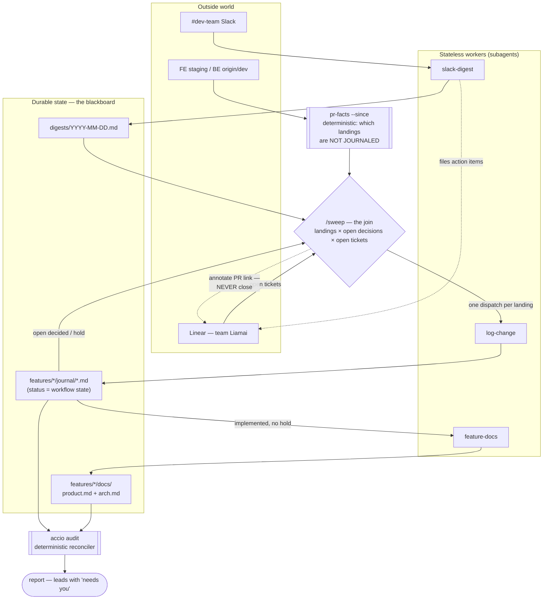
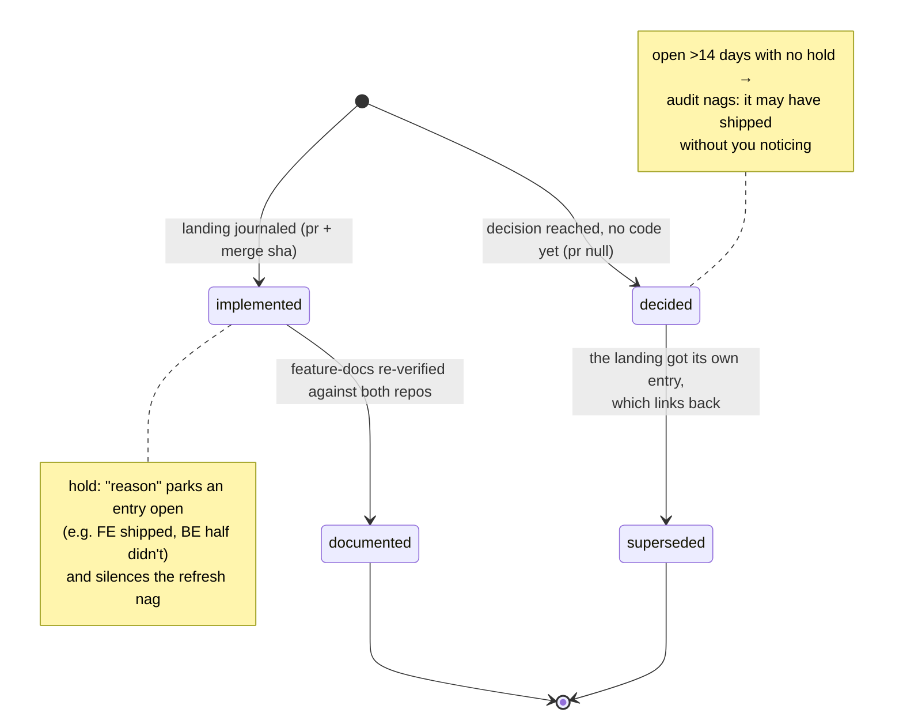

# ai-workspace

A one-person orchestration workspace for **alden-portal**: it watches the places where
change happens — #dev-team Slack, Linear (team `Liamai`), and the FE/BE repos — and keeps
three durable records honest: a daily Slack digest, a per-feature change journal (the
"why" layer), and dual-tier feature docs (the "what" layer, verified against both repos).
Built for a part-time schedule: everything is incremental, idempotent, and catch-up-safe,
so the first run after days away simply backfills.

## Architecture

The design is a blackboard, not a pipeline of agents:

- **Durable state lives in files.** `digests/`, `features/*/journal/`, `features/*/docs/`.
  Statuses in journal frontmatter (`decided → implemented → documented`, with
  `superseded` and `hold:` as the explicit escape hatches) are the workflow state — no
  agent's memory is load-bearing.
- **Reconciliation is deterministic.** `pr-facts --since` says which landings lack a
  journal entry; `accio audit` cross-checks docs against code and journal entries against
  each other (including decisions whose change landed without anyone linking back). Code
  does the joins an LLM would only guess at.
- **Agents are stateless workers.** `slack-digest`, `log-change`, `feature-docs` each make
  one kind of file current, in a subagent, and can be re-run at any time.
- **`/sweep` is the scheduler, and it is deliberately dumb.** Each tick it makes the
  digest current, scans for unjournaled landings, joins them against open tickets and
  open decisions, dispatches workers per item, audits, and reports — the files decide
  what runs. `/loop 2h /sweep` is the intended mode.



The one rule that keeps this safe to run unattended: **the sweep writes facts and
questions, never guesses.** An unattributed landing is journaled with `ticket: null` and
asked about in the report; a ticket whose work appears already merged is annotated with
the PR link but closing it stays a human decision — a landing may implement half a
ticket, and a wrongly closed ticket vanishes from the only queue that gets read.

### Lifecycle of one change

A journal entry is one **landing on staging** (or one decision awaiting code) — never one
day, never one commit:



`accio audit` enforces the edges: an `implemented` entry the doc refresh ran past, a
`decided` entry whose ticket landed in another entry, a `hold:` with no reason — each is
a named problem, and the sweep report carries them verbatim.

## Layout

| Path | What it is |
|---|---|
| `digests/` | daily Slack digests (`.state.json` is gitignored cursor state) |
| `alden/alden-portal/features/<dir>/docs/` | dual-tier docs — `product.md` + `arch.md` |
| `alden/alden-portal/features/<dir>/journal/` | change journal, one file per landing |
| `alden/alden-portal/.doc-workspace/` | feature manifest + OpenAPI snapshot |
| `skills/` | the workers and the scheduler (`sweep`, `slack-digest`, `log-change`, `feature-docs`, `linear-ticket`, `api-lookup`, `office-hours`) |
| `scripts/accio.ts` | index / sync / audit over docs + journal |
| `skills/log-change/scripts/pr-facts.ts` | resolve a landing; `--since` finds unjournaled ones |

## Running it

```sh
/loop 2h /sweep          # the whole loop, self-maintaining while a session is alive
/sweep                   # one manual pass ("catch me up")
/slack-digest            # digest only
/log-change              # journal one landing by hand
bun run accio audit      # reconcile without writing anything
bun skills/log-change/scripts/pr-facts.ts --since 2026-08-21   # what landed, what's unjournaled
```

Everything commits locally and never pushes; anything needing judgement lands in the
sweep report, not in a file.
