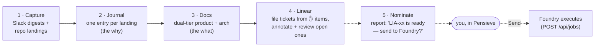
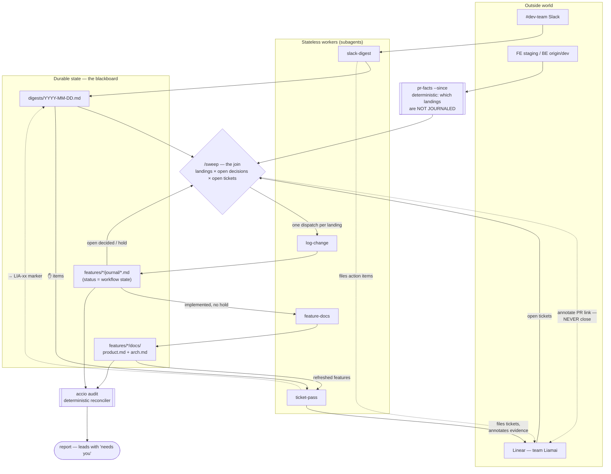
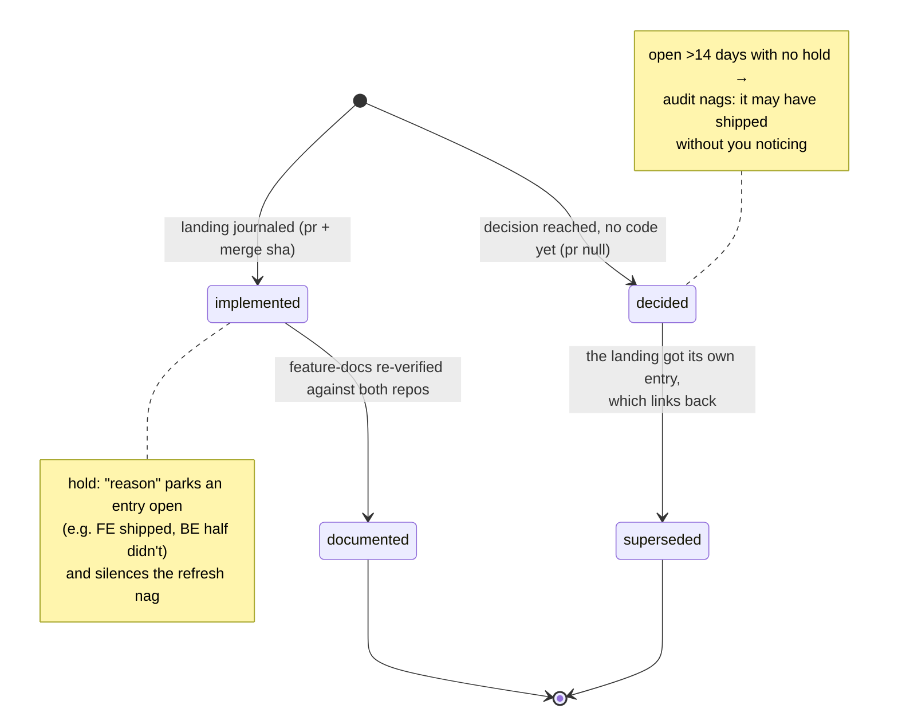
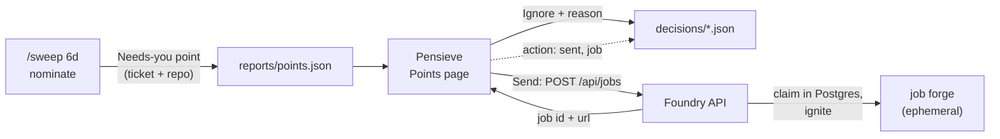

# argus

A one-person orchestration workspace for **alden-portal**: it watches the places where
change happens — #dev-team Slack, Linear (team `Liamai`), and the FE/BE repos — and keeps
three durable records honest: a daily Slack digest, a per-feature change journal (the
"why" layer), and dual-tier feature docs (the "what" layer, verified against both repos).
Built for a part-time schedule: everything is incremental, idempotent, and catch-up-safe,
so the first run after days away simply backfills.

## The three systems, as of 2026-09-07

Three repos share this work. Each has one job, and the seams between them are files and
one HTTP API — nothing else.

| | job | today | never |
|---|---|---|---|
| **argus** (this repo) | Knows. The blackboard is the single source of truth for everything not in Linear or a repo; the sweep keeps it current, reconciles landings against tickets, and nominates what needs a decision. | Files (`digests/`, `reports/`, `features/*/journal`, `features/*/docs`) plus skills run by `/loop` sessions. Produces a report; holds no queue. | Dispatch work. Close tickets. Run as a daemon. |
| **Pensieve** (`~/git/pensieve`) | The decision surface. Where you read what argus reports and decide what to act on. | Renders the report, digests, journal and docs for every app under the blackboard; the Points page sends a point to Foundry or ignores it; Ask answers over the checkout and proposes a verdict that a click confirms. Writes `decisions/` and nothing else. | Hold workflow state of its own. Write any blackboard file other than `decisions/`. |
| **Foundry** (`~/git/foundry`) | Executes. Takes a job over HTTP, runs it in an ephemeral forge, pushes a PR, reports back. | Jobs, blueprints, repos, forges, the trigger API. The `agent-ready` ticket scanner that made it a decider too is gone (LIA-93). | Read the blackboard. Judge readiness. Choose what runs. |

One line: **argus knows, you decide in Pensieve, Foundry does.**

The decision now happens on the screen where the report is read: the sweep emits each
Needs-you point as data, and Pensieve's Points page sends a point to Foundry or ignores it
with a reason. The `agent-ready` label that used to be the handoff is retired — inert on
the tickets that carry it, applied by nothing, read by nothing — and Foundry's scanner is
gone. From Ask, the model can propose a verdict that the same click confirms; the tool it
calls never writes. That work landed as waves 1 to 5 of `PLAN.md`, which also holds what
is still open (a `verified` verdict, and Ask filing a ticket); the diagram is
`canvas/setup.json` (`bun run canvas`, then `?g=setup`). "Downstream" at the bottom is the
current contract.

## The loop at a glance

Each sweep tick walks four stages, each feeding the next; a fifth nominates ready
tickets, dashed because what happens after it is your call, made in Pensieve:



## Architecture

The design is a blackboard, not a pipeline of agents:

- **Durable state lives in files.** `digests/`, `features/*/journal/`, `features/*/docs/`.
  Statuses in journal frontmatter (`decided → implemented → documented`, with
  `superseded` and `hold:` as the explicit escape hatches) are the workflow state — no
  agent's memory is load-bearing.
- **Reconciliation is deterministic.** `pr-facts --since` says which landings lack a
  journal entry; `accio audit` cross-checks docs against code and journal entries against
  each other (including decisions whose change landed without anyone linking back). Code
  does the joins an LLM would only guess at.
- **Agents are stateless workers.** `slack-digest`, `log-change`, `feature-docs` each make
  one kind of file current, in a subagent, and can be re-run at any time; `ticket-pass`
  does the same for Linear (files tickets from ✋ items, reviews open ones against
  refreshed docs) and marks the digest file so its work is visible to the next tick. A
  stage gets a subagent when its reading is bulky *and* its output lands on the
  blackboard — the join, nomination and the report stay in the sweep itself.
- **`/sweep` is the scheduler, and it is deliberately dumb.** Each tick it makes the
  digest current, scans for unjournaled landings, joins them against open tickets and
  open decisions, dispatches workers per item, audits, and reports — the files decide
  what runs. `/loop 2h /sweep` is the intended mode.



The one rule that keeps this safe to run unattended: **the sweep writes facts and
questions, never guesses.** An unattributed landing is journaled with `ticket: null` and
asked about in the report; a ticket whose work appears already merged is annotated with
the PR link but closing it stays a human decision — a landing may implement half a
ticket, and a wrongly closed ticket vanishes from the only queue that gets read.

### Lifecycle of one change

A journal entry is one **landing on staging** (or one decision awaiting code) — never one
day, never one commit:



`accio audit` enforces the edges: an `implemented` entry the doc refresh ran past, a
`decided` entry whose ticket landed in another entry, a `hold:` with no reason — each is
a named problem, and the sweep report carries them verbatim.

## What each source is for

Every source is in the loop because it is the **only** place one kind of truth lives, and
nothing is trusted for a question it cannot answer.

| External source | Owns | Why nothing else can answer it |
|---|---|---|
| **#dev-team Slack** | Intent — what was decided, who asked, why | The only source that exists *before* code or tickets do, and the most perishable: a decision scrolls away in a day. Git can never answer "why". |
| **FE / BE repos** (`origin/staging`, `origin/dev`) | What actually happened | Code is ground truth; everything else is claims about it — a thread can say "the endpoint now fully replaces" while `origin/dev` proves it doesn't. Always read via `origin/<ref>`: local trees go stale silently, and a stale read invents facts instead of erroring. |
| **Linear** (team `Liamai`) | Your commitments | One-person truth: what you are on the hook for. Teammates don't reference these keys, so it can't say what *they* did — and it records intent-to-do, so the system annotates but never closes; only you can judge whether a landing discharged the intent. |

The derived files each cache one join so it is never recomputed:

| Derived file | The join it caches |
|---|---|
| `digests/` | Slack made durable — permalinked and triaged, so nothing ever re-reads raw threads |
| `reports/` | The sweep's judgement calls made durable — the only file that holds inference (appears-implemented, appears-redundant, nominations), so it is a snapshot per day, never a source anything else reads back |
| `features/*/journal/` | The spine: *this* decision + *this* ticket + *this* landing. That connection exists in no single external source — Slack doesn't know the PR, git doesn't know the why, Linear doesn't know the merge sha — which is why frontmatter is never guessed: a wrong key corrupts the only record of the join. |
| `features/*/docs/` | The repos distilled to present-tense facts, sha-stamped (`last_verified` / `last_verified_be`) so staleness is detectable rather than suspected |
| `.doc-workspace/` (manifest + OpenAPI) | Routing — which files and endpoints belong to which feature; what lets a diff or an endpoint named in Slack be attributed at all |

The sweep just walks these in order: capture the perishable one, check claims against
ground truth, join, and surface only the judgement calls.

## Layout

| Path | What it is |
|---|---|
| `digests/` | daily Slack digests (`.state.json` is gitignored cursor state) |
| `reports/` | one sweep report per day, updated in place each tick — Needs-you / Linear / Audit re-emitted as current state, Done-today appended per tick; never shrunk by a quiet tick |
| `reports/points.json` | the current Needs-you section as data — one record per point with a stable `<group>/<slug>` id, `firstSeen`, and `ticket` / `repo` when known; derived from the day's report by `skills/sweep/scripts/points.ts` every tick, never hand-edited. What Pensieve lists to Send / Ignore a point (LIA-94) and what decisions are keyed by (LIA-88) |
| `decisions/<group>/<slug>.json` | one file per Send / Ignore verdict on a Needs-you point, `{ point, action, reason, at, subject, job? }`. Written by Pensieve (LIA-94), only ever read and committed by the sweep: `points.ts` matches each file's `point` against the tick's points, drops a decided point from the report's Needs-you and keeps it in `points.json` with the `decision` attached (LIA-88). A file whose point is gone is history, left alone |
| `alden/alden-portal/features/<dir>/docs/` | dual-tier docs — `product.md` + `arch.md` |
| `alden/alden-portal/features/<dir>/journal/YYYY-MM/YYYY-MM-DD/` | change journal, one file per landing, grouped by month and day |
| `alden/alden-portal/.doc-workspace/` | feature manifest + OpenAPI snapshot |
| `foundry/`, `pensieve/` | the same `features/<dir>/docs/` + `.doc-workspace/` layout for the two single-repo apps (`~/git/foundry`, `~/git/pensieve`). No backend repo, so their docs carry no `be:` sources and no `## FE/BE Mismatches`; their manifests are hand-curated, since `accio map` needs an FE route tree plus an OpenAPI spec and neither app has one. Pensieve discovers them by their `features/` tree and addresses a feature as `<app>/<dir>`; `accio` is still hardcoded to `alden/alden-portal` except `accio point` / `accio ticket`, which walk every app's journal and docs the same way (`scripts/lib/journal.ts` `appRoots`) |
| `skills/` | the workers and the scheduler (`sweep`, `slack-digest`, `log-change`, `feature-docs`, `linear-ticket`, `api-lookup`, `office-hours`), `prototyping` for fast issue-to-PR spikes, and `ask` — the read-only procedure for answering a question about the blackboard, which every session that opens this checkout (a terminal, Pensieve's Ask, the sweep) loads on a question-shaped prompt |
| `scripts/accio.ts` | index / sync / audit over docs + journal, plus the two read verbs behind `ask`: `accio point <group>/<slug>` (one Needs-you point: its `points.json` record, report lines, decision, journal entries across every app, rule ids resolved to doc lines, path tokens resolved in the checkouts with `git log`) and `accio ticket LIA-nn` (open points, journal entries and their rule ids, then `body: mcp__linear__get_issue LIA-nn` — argus holds no Linear key, the session reads the body). Both touch no `.state/` file and never `fetch` or `checkout` |
| `scripts/sync-skills.ts` | symlink every `skills/<name>/` into the global Claude skills folder, per skill; prunes only its own dangling links |
| `scripts/bootstrap.sh` | brand-new Mac → running sweep, in phases; `--check` reports without touching anything ("Setting it up") |
| `scripts/lib/shared-env.ts` | reader for `~/.config/liamai/env`, the credentials file shared with Foundry and Pensieve (`SLACK_TOKEN`, `LINEAR_API_KEY`, `FOUNDRY_API_TOKEN`); scripts read it themselves, nothing is exported shell-wide |
| `.env.example` | argus needs no `.env`; the file only says where `SLACK_TOKEN` lives and that a local `.env` overrides it |
| `skills/log-change/scripts/pr-facts.ts` | resolve a landing in either repo and name the features it touches (FE via the index's reach sets, BE via `be_files` + changed route lines → endpoint owners); `--since` finds unjournaled ones |
| `skills/sweep/scripts/points.ts` | `reports/<day>.md` → `reports/points.json`, carrying `firstSeen` forward, syncing the report's ages and applying `decisions/` (decided points out of Needs-you, count under Housekeeping, unreadable files under Audit); `--dry-run` prints without writing |

## Setting it up

`./scripts/bootstrap.sh` takes a brand-new Mac to the point where `bun run sweep` works.
Same shape as Foundry's: phases that run alone (`prereqs`, `repos`, `deps`, `skills`,
`state`, `env`, `check`), `--check` to report without changing anything, a prompt before
every install, a no-op when a step is already done. It installs git / bun / `claude`,
reports whether the product checkouts the feature manifests name are where they should
be (cloning them is yours — nothing here knows a remote), runs `bun install`, links the
skills globally, rebuilds `.state/` from the FE tree, and puts `SLACK_TOKEN` in the shared
credentials file `~/.config/liamai/env` — the one file argus, Foundry and Pensieve all
read, so each secret is typed once per Mac (`foundry auth` writes the same file). The one
thing it can only point you at is the Linear MCP login, which is `/mcp` → linear →
Authenticate inside a Claude session opened in this directory.

```sh
./scripts/bootstrap.sh            # everything, asking first
./scripts/bootstrap.sh --check    # what's missing, touching nothing
./scripts/bootstrap.sh check      # just: is the Linear MCP server authenticated?
```

## Running it

```sh
/loop 2h /sweep          # the whole loop, self-maintaining while a session is alive
/sweep                   # one manual pass ("catch me up")
/slack-digest            # digest only
/log-change              # journal one landing by hand
bun run accio audit      # reconcile without writing anything (fails when a feature's two doc tiers disagree)
bun run accio stale      # which features' docs drifted, and why (tiers / fe-core / be-handlers / journal)
bun run accio journal    # day view over landings (a date, or --since YYYY-MM-DD)
bun run accio point decide/lia-71-history-rollup   # one Needs-you point, everything the blackboard holds on it
bun run accio ticket LIA-71                        # a ticket's open points, journal entries, rule ids; body via Linear MCP
bun skills/log-change/scripts/pr-facts.ts --since 2026-08-21   # what landed, what's unjournaled
bun skills/sweep/scripts/points.ts --dry-run                    # today's Needs-you as points, without writing
bun run sync-skills      # after adding/removing a skill: make it global (--check to only report)
```

Everything commits locally and never pushes; anything needing judgement lands in the
sweep report, not in a file.

## Downstream: sending a ticket to Foundry

[Foundry](~/git/foundry) — the orchestration layer for disposable Claude Code forges —
executes what this workspace nominates and you approve. It never reads the blackboard and
never judges readiness; it takes one HTTP call and runs it. This section is the contract
between the three repos.

**Ready is an explicit signal, not an inference.** A ticket qualifies mechanically when
its **Pending** section is empty, it has no blocked-by relation, and its Acceptance
Criteria are concrete (observable outcomes, each grounded in a Technical Note, per the
linear-ticket house format) — but nothing acts on that alone. The handoff is three steps,
judgement staying on this side:

1. **Sweep nominates.** Sweep step 6d checks every open ticket against that bar each
   tick; a qualifying ticket gets a Needs-you line under Decide ("**LIA-xx is ready** —
   send to Foundry?"). Nomination is inference, so it goes in the report, never into
   Linear. `points.ts` carries it into `reports/points.json` with `ticket` and, from the
   title tag, `repo`.
2. **You decide in Pensieve.** The Points page shows the point with Send and Ignore.
   Send is present only on a point that names a ticket; Ignore always asks for a reason.
   An Ask opened from the point shows the same controls, and the model can propose a
   verdict as a card whose Confirm is the same click. Either way one file lands in
   `decisions/<group>/<slug>.json`, and the point drops out of the next tick's Needs-you.
   Ignore is a dismissal: the reason is stored and nothing acts on it.
3. **Foundry executes.** Send is a `POST /api/jobs` with `ticketId`, `repo` and the point
   id as the `Idempotency-Key` — no brief. Foundry composes the brief from the ticket
   body, claims the ticket atomically (job row in its Postgres ledger, unique on ticket
   key, *before* touching Linear), marks it In Progress and ignites an ephemeral job
   forge; the Acceptance Criteria are its definition of done.



Ground rules, mirroring the sweep's own write policy:

- **No Send, no pickup.** An unblocked ticket is not the same as the ticket you want
  worked next; nothing downstream guesses the queue order, and no label signals it —
  `agent-ready` is retired and read by nothing.
- **Claim before work.** The Postgres insert is the lock — a double click, a retry after
  a timeout, or you plus the agent can never double-work a ticket; the point id is the
  idempotency key that makes the retry safe.
- **Decide after a sweep tick**, so what you send is reconciled state rather than a
  ticket a fresh landing already mooted.
- **Own worktree, always.** Job forges work in per-job clones (`~/.foundry/jobs/<id>/`),
  never the shared FE working tree.

Foundry's own README documents the API and the forge internals; this section stays the
source of truth for the nomination flow and what a Send means.
