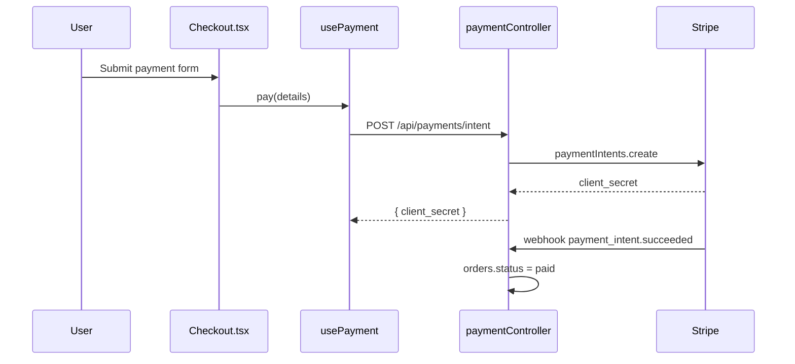

# TASK: Generate Dual-Tier Documentation (Feature-by-Feature Protocol)

You are an automated technical writer and repository analyst. You will document this application one complete FEATURE at a time using a strict, token-safe phased loop.

Do not analyze the entire repo at once. Work strictly feature by feature to prevent context loss.

All output paths below are relative to the documented app's root. Docs are grouped BY FEATURE: each feature owns one folder holding both tiers side by side — `/features/<dir>/docs/product.md` and `/features/<dir>/docs/arch.md` — so everything about a feature (specs, notes, docs) lives in one place. Shared modules live under `/features/shared/<id>/docs/arch.md`. `<dir>` defaults to the feature id (with `admin-x` nesting to `admin/x`); a manifest entry may override it with a `dir` field to match an existing folder layout.

---

## Phase 1: Feature Mapping (Discovery)

Scan entry points, page routes, controller modules, and user workflows in the repo.
Group the codebase into distinct end-to-end FEATURES (e.g., "User Authentication", "Checkout & Payments", "Order Management").

Also identify SHARED MODULES — cross-cutting code used by two or more features (auth, api-client, shared UI kit, db helpers). Shared modules get their own manifest entries with `"type": "shared"` and are documented FIRST, so feature docs can link to them instead of re-explaining them.

Create `.doc-workspace/feature-manifest.json` listing each entry, its entry files, associated APIs, UI components, and state:

```json
{
  "features": [
    {
      "id": "auth",
      "name": "Auth (shared)",
      "type": "shared",
      "status": "pending",
      "core_files": ["src/lib/auth.ts", "src/middleware/session.ts"]
    },
    {
      "id": "checkout-and-payments",
      "name": "Checkout & Payments",
      "type": "feature",
      "status": "pending",
      "entry_routes": ["/checkout", "/api/payments"],
      "core_files": [
        "src/pages/Checkout.tsx",
        "src/hooks/usePayment.ts",
        "src/controllers/paymentController.ts"
      ]
    }
  ]
}
```

`status` is one of `pending | in_progress | done | stale`. Set `in_progress` before reading files so a crashed run can be resumed unambiguously.

---

## Phase 2: Per-Entry Generation Loop

Process manifest entries in order: all `type: "shared"` entries first, then `type: "feature"`.

**Context isolation rule:** run each entry in a FRESH context — launch a new subagent (or new session) that receives only this protocol file and that entry's manifest object. Never carry file contents from one entry to the next; "clearing context" is achieved by process isolation, not by intent.

For each entry with `status: "pending"` (or `"stale"`, see Phase 4):

1. Set `status` to `"in_progress"` in the manifest.
2. Read ONLY the files listed under that entry's `core_files` (follow imports one level deep if a business rule lives in a helper).
3. **Backend verification (bounded).** When the run supplies a backend repo and pinned
   sha: for each endpoint in the arch doc's `## Interfaces & Contracts` region, locate
   its server handler — route declaration (`src/routers/v1/*.ts`) → controller method →
   the use-case/service functions the controller imports for that handler, ONE hop, stop
   there. Read only those files. Skip ORM/schema internals unless a business rule visibly
   lives in a schema constraint. The goal is verification, not mapping: confirm or refute
   FE-derived rules, resolve `UNVERIFIED:` claims, and capture server-only rules the FE
   cannot show (server-side validation, role enforcement, computed values). A fact whose
   evidence is backend code carries a `be:`-prefixed Source (e.g. `be:src/services/x.ts`).
   Where the tiers genuinely disagree, add a row to the arch doc's `## FE/BE Mismatches`
   section (template 3B) — do not silently pick a side.
4. Generate output using the EXACT templates in Phase 3. Do not deviate from the section names, order, or table columns — downstream agents locate information by these exact headings.
   - `type: "feature"` → BOTH tiers: `/features/<dir>/docs/product.md` and `/features/<dir>/docs/arch.md`.
   - `type: "shared"` → architecture tier only: `/features/shared/<id>/docs/arch.md` (template 3B; omit `product_doc` from frontmatter).
5. Set the entry's manifest `status` to `"done"` and record `docs_sha` (the current git HEAD sha).
6. Return to the orchestrator; the next entry starts in a fresh context.

Hard rules for BOTH tiers:

- **Facts only from code you read this iteration.** If a behavior cannot be confirmed in the files, write `UNVERIFIED:` before the claim or omit it. Never infer business rules.
- **Tables over prose. Bullets over paragraphs.** A retrieval agent should be able to answer a question from a single table row.
- **Stable heading names.** Headings are an API. Use the template headings verbatim, every file, every feature.
- **One fact, one place.** Product tier owns the "why/what"; architecture tier owns the "how/where". Cross-reference instead of duplicating. (Exception: `aliases` and `feature_name` are deliberately duplicated in both tiers' frontmatter — they are routing keys, not facts.)
- **Two-repo sourcing.** Frontend paths are bare; backend paths carry the `be:` prefix in
  every Source cell. Never mix a claim's evidence across repos in one row.
- **BE-verified freshness.** A product doc verified against backend code records
  `last_verified_be: <branch>@<shortsha>` and `last_verified_be_date` in frontmatter
  (product tier only — the arch tier's frontmatter is machine-owned).
- **Escape literal `|` inside table cells as `\|`.** A broken table is a protocol violation — it defeats row-level retrieval.

---

## Phase 3: Output Templates (STRICT)

### 3A. Product Feature Doc — `/features/<dir>/docs/product.md`

````markdown
---
id: checkout-and-payments
tier: product
feature_name: "Checkout & Payments"
status: active # active | deprecated | beta
owner: "" # team or person, if known
aliases: [checkout, payments, "pay flow", stripe] # every name a human might use when asking about this
related_features: [order-management, user-authentication]
arch_doc: ./arch.md
last_verified: <git sha>
last_verified_date: 2026-08-22
last_verified_be: dev@c9c52464b # backend sha the rules were checked against; omit if BE not read
last_verified_be_date: 2026-08-26
---

# Checkout & Payments

> **TL;DR:** One sentence: what this feature lets the user do and the one rule most people ask about.

## User Workflows

<!-- One H3 per workflow. Numbered steps. Each step = user action → system response. -->

### Complete a purchase

1. User clicks **Checkout** from the cart → system validates stock.
2. User enters payment details → system tokenizes via Stripe, never stores card data.
3. On success → order is created with status `paid`; confirmation email queued.

## Business Rules

<!-- THE most-retrieved section. One row per rule. Rule column is quotable standalone. -->

| #    | Rule                                      | Condition / Trigger                                 | Outcome                           | Source                 |
| ---- | ----------------------------------------- | --------------------------------------------------- | --------------------------------- | ---------------------- |
| BR-1 | Orders over $500 require 3DS verification | `amount > 50000` (cents) at payment intent creation | 3DS challenge shown               | `paymentController.ts` |
| BR-2 | Cart is locked during payment             | Payment intent status `processing`                  | Edits rejected with `CART_LOCKED` | `usePayment.ts`        |

## Edge Cases & Error States

| Scenario            | What the user sees                  | What actually happens              |
| ------------------- | ----------------------------------- | ---------------------------------- |
| Payment declined    | "Payment failed" toast, cart intact | Intent voided, no order created    |
| Double-click on Pay | Single charge                       | Idempotency key on intent creation |

## Out of Scope / Known Gaps

<!-- An `UNVERIFIED:` line that backend verification resolves is DELETED here and reborn
     as a verified Business Rules / Edge Cases row with a `be:` Source. If the answer is
     a divergence, it goes to the arch doc's `## FE/BE Mismatches` instead. -->

- Refunds are handled in [order-management](../../order-management/docs/product.md).
- UNVERIFIED: behavior when Stripe webhook is delayed > 24h.

## Glossary (feature-specific terms)

| Term   | Meaning                                                  |
| ------ | -------------------------------------------------------- |
| Intent | Stripe PaymentIntent object tracking one payment attempt |
````

### 3B. Technical Architecture Doc — `/features/<dir>/docs/arch.md`

````markdown
---
id: checkout-and-payments
tier: architecture
feature_name: "Checkout & Payments"
aliases: [checkout, payments, "pay flow", stripe]
product_doc: ./product.md
entry_routes: ["/checkout", "/api/payments"]
core_files:
  - src/pages/Checkout.tsx
  - src/hooks/usePayment.ts
  - src/controllers/paymentController.ts
depends_on_shared: [auth, api-client] # links to /features/shared/
external_services: [stripe, sendgrid]
data_stores: ["orders (postgres)", "payment_events (postgres)"]
env_vars: [STRIPE_SECRET_KEY, STRIPE_WEBHOOK_SECRET]
last_verified: <git sha>
last_verified_date: 2026-08-22
---

# Checkout & Payments — Architecture

> **TL;DR:** One sentence: the shape of the implementation (e.g., "React page → payment hook → Express controller → Stripe, with webhook-driven order finalization").

## Component Map

<!-- THE most-retrieved section. One row per moving part, in execution order. -->

| Component                        | Type            | Trigger                           | Calls / API                    | Data Store                    | File                                   |
| -------------------------------- | --------------- | --------------------------------- | ------------------------------ | ----------------------------- | -------------------------------------- |
| `Checkout.tsx`                   | UI page         | Route `/checkout`                 | `usePayment()`                 | —                             | `src/pages/Checkout.tsx`               |
| `usePayment`                     | Hook            | User submits form                 | `POST /api/payments/intent`    | —                             | `src/hooks/usePayment.ts`              |
| `paymentController.createIntent` | API handler     | `POST /api/payments/intent`       | Stripe `paymentIntents.create` | `payment_events` INSERT       | `src/controllers/paymentController.ts` |
| `stripeWebhook`                  | Webhook handler | Stripe `payment_intent.succeeded` | —                              | `orders` UPDATE status→`paid` | `src/controllers/paymentController.ts` |

## Sequence Diagram



## Interfaces & Contracts

<!-- Only interfaces OTHER features or agents would call. Full signatures. -->

### `POST /api/payments/intent`

- **Auth:** session cookie (see shared/auth)
- **Body:** `{ cartId: string }`
- **Returns:** `200 { clientSecret: string }` | `409 CART_LOCKED` | `422 EMPTY_CART`
- **Idempotent:** yes, keyed on `cartId + cart.version`

## State & Data

| Store / State          | Shape (key fields)                      | Written by                      | Read by          |
| ---------------------- | --------------------------------------- | ------------------------------- | ---------------- |
| `orders` table         | `id, status(pending\|paid\|failed), amount_cents` | `stripeWebhook`       | order-management |
| `payment_events` table | `intent_id, event_type, raw_payload`    | `createIntent`, `stripeWebhook` | audit only       |

## Failure Modes

| Failure                   | Detection               | Current handling                                     |
| ------------------------- | ----------------------- | ---------------------------------------------------- |
| Stripe timeout            | fetch abort 10s         | User-facing retry; intent may be orphaned (see Gaps) |
| Webhook signature invalid | `constructEvent` throws | 400, event dropped, logged                           |

## Gaps / Tech Debt

- Orphaned intents are never reconciled (no cleanup job found in code).

## FE/BE Mismatches

<!-- Optional — present only when backend verification found real divergences.
     Verified against backend <branch>@<shortsha>. One row per mismatch; Surface uses the
     exact endpoint key from Interfaces & Contracts (BE-only routes: write the path
     WITHOUT a method prefix so `accio audit` does not treat it as an FE claim). -->

| #    | Surface                    | FE behavior (file)                   | BE behavior (file)                           | Impact                            | Status              |
| ---- | -------------------------- | ------------------------------------ | -------------------------------------------- | --------------------------------- | ------------------- |
| MM-1 | `POST /api/payments/intent` | Blocks status X for role Y (`src/…`) | Accepts any status for any role (`be:src/…`) | Guard is FE-only; API unprotected | needs-clarification |

Statuses: `needs-clarification` (file a ticket, record its key in the row) \| `intended`
(a human confirmed the divergence — name who/where) \| `resolved` (code changed; promote
the fact to Business Rules and delete the row).
````

---

## Phase 4: Refresh Loop (keeping docs honest)

Run this on any subsequent invocation against a repo that already has a manifest:

1. For each entry with `status: "done"`, run:
   `git diff --name-only <docs_sha>..HEAD -- <core_files...>`
2. If the diff is non-empty, set that entry's `status` to `"stale"`. Stale entries are re-run through Phase 2 (fresh context, same rules), then marked `"done"` with the new `docs_sha`.
3. If the diff is empty, leave the entry untouched — do not rewrite docs or bump `last_verified` without actually re-reading code.
4. Detect NEW surface area: routes/entry files present in the repo but absent from every manifest entry → run Phase 1 incrementally and APPEND new entries. Never rewrite existing entries' ids — ids are stable keys that other docs link to.

---

## Phase 5: Change Journal (the "why" layer)

Docs are present-tense facts-from-code; the journal owns history and rationale — the
things code can never say: who asked, which ticket, what the decision was. **Docs never
become changelogs**, and journal entries never restate current behavior (the docs own
that). They link; they don't merge.

One file per change, in the folder of the feature it is mostly about:
`/features/<dir>/journal/YYYY-MM-DD-<slug>.md` — beside that feature's `docs/`, so a
feature's history is in the folder you already opened. A change touching several
features is still ONE file: `features:` stays the routing key and must name the
folder's own feature as well as the rest.

```markdown
---
date: 2026-08-23
source: "Slack #alden-product — Sarah's request" # or meeting / customer / null
ticket: ALD-123 # Trello/Linear key, if any
features: [admin-invoicings, tasks] # manifest ids, FLOW style — greppable routing
scope: product # product | architecture | both
status: decided # decided | implemented | documented
summary: Drafts become editable with an Approve-and-Send gate
---

What changes, before → after, and the reasoning/constraints from the discussion.
Quote the request where it disambiguates intent.
```

Lifecycle — `status` is the only field that ever changes after creation:

1. **decided** — the change is agreed but not in code. Docs are NOT touched (facts-only
   rule): the entry is the sole record of intent.
2. **implemented** — the code landed but docs haven't been re-verified yet.
3. **documented** — a Phase 2 re-run consumed this entry: the doc agent received it as
   context for the diff (the entry explains WHY the code changed), updated the docs from
   code, and closed the entry.

The Phase 4 refresh loop MUST collect a feature's non-`documented` entries and hand them
to the doc subagent alongside the manifest entry — the diff says what changed, the
journal says why. Close only entries whose change the agent actually confirmed in code.

---

## Retrieval Contract (why the format is strict)

A downstream agent answering questions MUST be able to:

1. **Route by frontmatter alone** — grep `aliases` + `feature_name` across `/features/**/docs/*.md` frontmatter to pick the right file without opening bodies; grep `features:` / `ticket:` across `/features/**/journal/*.md` to find a change's history the same way.
2. **Answer "what" questions from one table row** — Business Rules table (product tier).
3. **Answer "where/how" questions from one table row** — Component Map (architecture tier).
4. **Answer "does the server enforce this?" from one table row** — a Business Rules row with a `be:` Source, or an FE/BE Mismatches row (architecture tier).
5. **Trust freshness** — `last_verified` (frontend) and `last_verified_be` (backend) shas tell the agent whether to double-check against code.

Any output that a grep for the standard headings (`## Business Rules`, `## Component Map`, `## Interfaces & Contracts`, `## FE/BE Mismatches`) would not find is a protocol violation.
